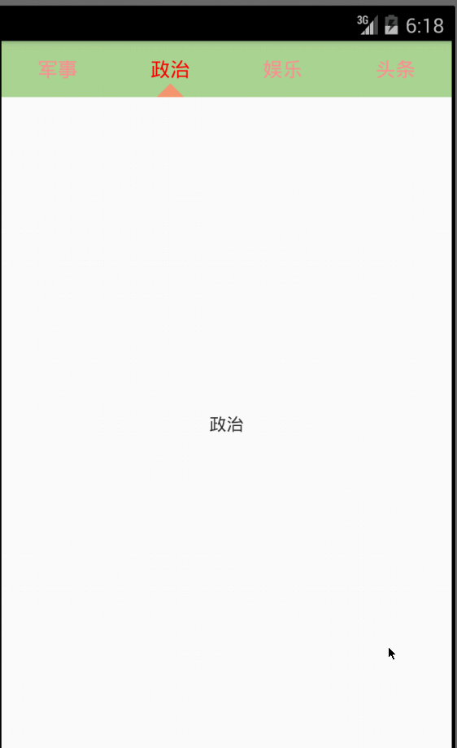
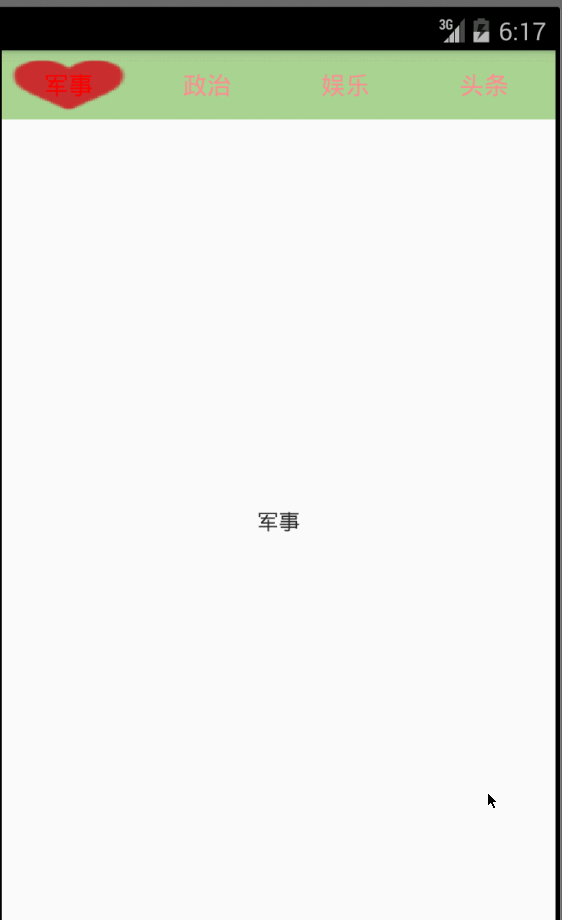

# 1.什么是 RVPIndicator #
###简单实用的ViewPageIndicator，支持item自身滚动

> 高仿MIUI但更胜于MIUI，提供多种指示器类型{下滑线，三角形，全背景}

> 觉得这不满足你的需求？没问题，**RVPIndicator** 还支持使用图片作为指示器。一张图实现你的愿望

# 2. RVPIndicator 使用 #
    
    <LinearLayout xmlns:android="http://schemas.android.com/apk/res/android"
    xmlns:tools="http://schemas.android.com/tools"
    xmlns:rvp="http://schemas.android.com/apk/res-auto"
    android:layout_width="match_parent"
    android:layout_height="match_parent"
    android:background="#ffffffff"
    android:orientation="vertical" >

    <cn.r.vpindicator.android.view.RVPIndicator
        android:id="@+id/id_indicator"
        android:layout_width="match_parent"
        android:layout_height="45dp"
        android:background="#ADD597"
        android:orientation="horizontal"
        rvp:indicator_color="#f29b76"
        rvp:indicator_src="@drawable/heart_love"
        rvp:indicator_style="triangle"
        rvp:item_count="4"
        rvp:text_color_hightlight="#FF0000"
        rvp:text_color_normal="#fb9090" />

    <android.support.v4.view.ViewPager
        android:id="@+id/id_vp"
        android:layout_width="match_parent"
        android:layout_height="0dp"
        android:layout_weight="1" />

	</LinearLayout>

## 2.1 自定义属性解释 ##
	    rvp:indicator_color="#f29b76"				
		//指示器颜色
        rvp:indicator_src="@drawable/heart_love"	
		//指示器图片{指示器类型为bitmap时需要}
        rvp:indicator_style="triangle"				
		//指示器类型
        //{bitmap：图片；line：下划线；square：方形全背景；triangle：三角形}
        rvp:item_count="4"							
		//item展示个数
        rvp:text_color_hightlight="#FF0000"			
		//item文字高亮颜色
        rvp:text_color_normal="#fb9090"				
		//item文字正常颜色

## 2.2 代码调用 ##
    	// 设置Tab上的标题
		mIndicator.setTabItemTitles(mDatas);

		// 设置关联的ViewPager
		mIndicator.setViewPager(mViewPager, 0);

		// Indicator选中监听
		mIndicator.setOnIndicatorSelected(new OnIndicatorSelected() {
			@Override
			public void setOnIndicatorSelected(int position, String title) {
				LogUtils.w("------OnIndicatorSelected-------position="
						+ position + "--title=" + title);
			}
		});

## version ##
v1.0.2
.修复7.0以上系统无法显示title

v1.0.1
.添加Indicator选中回调监听

> 我的博客 http://blog.csdn.net/u014702653?viewmode=contents

