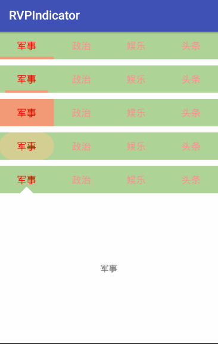

# RVPIndicator

## 欢迎使用 RVPIndicator 

### 1.特点

> 简单实用的ViewPager指示器 实现联动，自身滚动。
> 
> 高仿MIUI但更胜于MIUI，提供多种指示器类型。支持类型 : 下滑线，三角形，全背景，图片

### 2.效果图

 

### 3.属性说明

> 开发者根据实际需要选择使用对应的功能属性

| 属性			|说明			 |
| ------------- |  :-------------|
| text_color_normal   			|	文本颜色		默认		|
| text_color_selected       	|   文本颜色		选中		|
| text_size 					|	文本大小		 		|
| indicator_visible_count 		|   屏幕可见指示器数量		|
| indicator_color 				|   指示器颜色		 	|
| indicator_style 				|   指示器样式 	{ bitmap：图片；line：下划线；square：方形全背景；triangle：三角形 }	|
| style_bitmap_src 				|   指示器图片路径  style=bitmap有效 	|
| style_line_padding 			|   指示器下划线左右padding	style=line有效 	|

### 4.使用
> ### 4.1  Gradle （版本号根据更新历史使用最新版）

    compile 'com.ruffian.library:RVPIndicator:1.0.3'

> ### 4.2 XML使用

       <com.ruffian.library.RVPIndicator
        android:layout_width="match_parent"
        android:layout_height="45dp"
        android:background="#ADD597"
        android:orientation="horizontal"
        
        //指示器颜色
        rvp:indicator_color="#ffffff"
        //指示器样式
        rvp:indicator_style="triangle"
        //指示器可见数量
        rvp:indicator_visible_count="4"
    
        //指示器图片
        rvp:style_bitmap_src="@mipmap/ic_launcher"
    
        //线性指示器左右padding
        rvp:style_line_padding="10dp"
    
        //文字默认颜色
        rvp:text_color_normal="#fb9090"
        //文字选中颜色
        rvp:text_color_selected="#FF0000"
        //文字大小
        rvp:text_size="20sp" />

> ### 4.3.1 代码调用（功能代码）

        // 设置Tab上的标题
        mIndicator.setTitleList(mList);

        // 设置关联的ViewPager
        mIndicator.setViewPager(mViewPager, 0);

        //设置Adapter
        mViewPager.setAdapter(mAdapter);

    
> ### 4.3.2 代码调用（可选功能代码）

        //设置线性指示器左右Padding
        mIndicator.setStyleLinePadding(10);
        //设置title
        mIndicator.setTitle("哈哈哈", 1);
        mIndicator.setTitleList(mList);

        // Indicator选中监听
        mIndicator.setOnIndicatorSelected(new RVPIndicator.OnIndicatorSelected() {

            @Override
            public void setOnIndicatorSelected(int position, String title) {
                Log.w("TAG", "setOnIndicatorSelected");
            }
        });

        // PageChange监听
        mIndicator.setOnPageChangeListener(new RVPIndicator.PageChangeListener() {

            @Override
            public void onPageSelected(int position) {
                Log.w("TAG", "onPageSelected");
            }

            @Override
            public void onPageScrolled(int position, float positionOffset, int positionOffsetPixels) {
                Log.w("TAG", "onPageScrolled");
            }

            @Override
            public void onPageScrollStateChanged(int state) {
                Log.w("TAG", "onPageScrollStateChanged");
            }
        });

### 5.版本历史

**v1.0.3**　`2017.09.08`　发布正式版本

